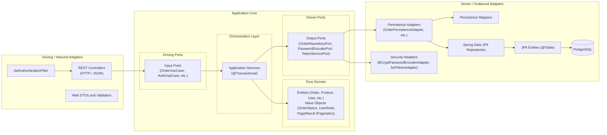
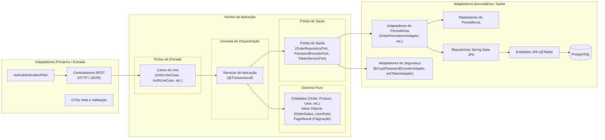

# E-Commerce Backend API

[English](#english) | [Português (Brasil)](#português-brasil)

---

<a name="english"></a>

## English

A modern, robust e-commerce RESTful API developed with Java 21 and Spring Boot, architected using Hexagonal Architecture (Ports and Adapters), secured with Spring Security, JWT (JSON Web Tokens), and RBAC (Role-Based Access Control), and backed by PostgreSQL.

### Table of Contents

- [Overview](#overview)
- [Architectural Decisions and Design Principles](#architectural-decisions-and-design-principles)
  - [Why Hexagonal Architecture?](#why-hexagonal-architecture)
  - [Core Hexagon vs. Adapters](#core-hexagon-vs-adapters)
  - [Domain Invariants and Database Integrity](#domain-invariants-and-database-integrity)
- [Project Directory Structure](#project-directory-structure)
- [Tech Stack](#tech-stack)
- [Security and Authentication](#security-and-authentication)
- [Database Setup and Migrations](#database-setup-and-migrations)
- [API Endpoints and Access Control](#api-endpoints-and-access-control)
- [Pagination and Filtering](#pagination-and-filtering)
- [Error Handling (RFC 7807)](#error-handling-rfc-7807)
- [Getting Started](#getting-started)
  - [Prerequisites](#prerequisites)
  - [Configuration](#configuration)
  - [Running the Application](#running-the-application)
  - [Running Tests](#running-tests)
- [Related Documentation](#related-documentation)

### Overview

This project provides the backend services for an e-commerce platform, handling catalog management, user registrations, authentication, cart item orders, payment processing, and checkout workflows.

Originally structured as a traditional 3-tier layered system, the project was migrated to Hexagonal Architecture (Ports and Adapters) to cleanly decouple business logic from external frameworks, databases, and delivery mechanisms.

### Architectural Decisions and Design Principles



#### Why Hexagonal Architecture?

1. **Framework Independence**:
   - The core business domain in `com.ecommerce.domain` contains zero dependencies on Spring, Hibernate, or Jakarta Persistence.
   - Business models and pagination structures (`PageResult<T>`) are pure Java types that can be tested in isolation without initializing an application context.

2. **Decoupled Delivery, Security, and Persistence Mechanisms**:
   - Web representations (REST DTOs) are confined to the Inbound REST adapter (`infrastructure/adapters/input/rest`).
   - Security infrastructure (JWT token creation, BCrypt password encoding) is isolated in driven output adapters implementing domain-level ports (`PasswordEncoderPort`, `TokenServicePort`).
   - Database schemas (Hibernate entities, `@Table`, `@ManyToOne`) are confined to the Outbound Persistence adapter (`infrastructure/adapters/output/persistence`).
   - Dedicated mappers convert between outer representations and internal domain models at the adapter boundaries.

3. **Inversion of Control via Ports**:
   - The Application core defines **Inbound Ports** (`UseCase` interfaces) declaring executable operations, and **Outbound Ports** (`RepositoryPort`, `PasswordEncoderPort`, `TokenServicePort` interfaces) declaring persistence and infrastructure requirements.
   - External implementations depend inward on these contracts.

#### Domain Invariants and Database Integrity

- **Centralized Business Rules**: Invariants such as stock deductions, stock replenishment, line-item totals, and order status transitions are encapsulated directly within domain entities (`Product.deductStock()`, `Order.calculateTotal()`).
- **Database Safeguards**: SQL triggers and checks defined in `01_create_database.sql` and `02_functions_triggers_views.sql` serve as secondary integrity safeguards at the database storage layer.

### Project Directory Structure

```
application/src/main/java/com/ecommerce
├── EcommerceApplication.java                   # Spring Boot entry point
│
├── domain/                                     # 1. CORE: Pure Domain (Framework-free)
│   ├── exception/                              # DomainException, ResourceNotFoundException, InsufficientStockException
│   ├── model/                                  # Entities (Order, Product, User, Category, Payment, ProductOrder, PageResult, UserRole)
│   └── valueobjects/                           # OrderStatus, PaymentStatus
│
├── application/                                # 2. CORE: Application and Use Cases
│   ├── ports/
│   │   ├── input/                              # Driving Ports (CategoryUseCase, OrderUseCase, ProductUseCase, UserUseCase, AuthUseCase)
│   │   └── output/                             # Driven Ports (Repository ports, PasswordEncoderPort, TokenServicePort)
│   └── service/                                # Application Services (Auth, Category, Order, Product, User)
│
└── infrastructure/                             # 3. ADAPTERS: Infrastructure and Frameworks
    ├── adapters/
    │   ├── input/
    │   │   └── rest/                           # Driving Adapters (REST Controllers, Web DTOs, Exception Handler)
    │   │       ├── controller/                 # AuthController, CategoryController, OrderController, ProductController, etc.
    │   │       ├── dto/                        # Request/Response records (UserDTO, ProductDTO, LoginRequestDTO, AuthResponseDTO, etc.)
    │   │       └── exception/                  # GlobalExceptionHandler (RFC 7807 ProblemDetail @RestControllerAdvice)
    │   │
    │   └── output/
    │       └── persistence/                    # Driven Adapters (PostgreSQL / Spring Data JPA)
    │           ├── adapter/                    # OrderPersistenceAdapter, ProductPersistenceAdapter, UserPersistenceAdapter, etc.
    │           ├── entity/                     # CategoryJpaEntity, OrderJpaEntity, ProductJpaEntity, UserJpaEntity, etc.
    │           ├── mapper/                     # Domain <-> JPA bidirectional mappers
    │           └── repository/                 # SpringDataCategoryRepository, SpringDataUserRepository, etc.
    │
    └── security/                               # Security Infrastructure (BCryptPasswordEncoderAdapter, JwtTokenAdapter,
                                                # JwtAuthenticationFilter, SecurityConfig)
```

### Tech Stack

- **Language**: Java 21 (LTS)
- **Framework**: Spring Boot 4.1.0
  - `spring-boot-starter-web` (REST APIs)
  - `spring-boot-starter-security` (Authentication and authorization)
  - `spring-boot-starter-data-jpa` (Hibernate ORM and Spring Data)
  - `spring-boot-starter-validation` (Jakarta Validation)
  - `spring-boot-starter-session-jdbc` (Session state management)
- **Security & Tokens**:
  - `io.jsonwebtoken:jjwt-api:0.12.6` (HMAC-SHA256 stateless tokens)
  - `BCryptPasswordEncoder` (salted password hashing)
- **Database**: PostgreSQL 16
- **Database Migrations**: Flyway
- **Boilerplate Reduction**: Project Lombok
- **Testing**: JUnit 5, Mockito, Spring Boot Test, Spring Security Test

### Security and Authentication

The API uses stateless JSON Web Token (JWT) authentication with Role-Based Access Control (RBAC):

1. **Password Hashing**: User passwords are encrypted with BCrypt (strength 10) before storage in `tb_user`. Plaintext passwords are never stored or exposed in API responses.
2. **JWT Authentication**:
   - Obtain tokens via `POST /api/auth/login`.
   - Transmit tokens in the HTTP header: `Authorization: Bearer <token>`.
   - Tokens contain subject (`email`), `userId`, `name`, and `role` claims.
3. **Roles**:
   - `ROLE_CLIENT`: Default role assigned upon registration. Can browse catalog, place orders, view personal order history, and view/update personal profile.
   - `ROLE_ADMIN`: Store administrators. Required for creating, updating, or deleting products and categories.

### Database Setup and Migrations

The database schemas and analytical objects are maintained in the root SQL scripts:

- `01_create_database.sql`: DDL definitions for tables (`tb_user`, `tb_category`, `tb_product`, `tb_payment`, `tb_order`, `tb_product_order`), columns (`role`), and performance indexes.
- `02_functions_triggers_views.sql`: Triggers (`trg_check_product_stock`, `trg_update_order_total`), helper procedures, and analytics views (`vw_product_sales_summary`, `vw_customer_summary`, `vw_low_stock_products`).

### API Endpoints and Access Control

All REST endpoints are prefixed with `/api` and return standardized JSON responses:

| Resource           | Method   | Endpoint               | Access Control | Description                   |
| :----------------- | :------- | :--------------------- | :------------- | :---------------------------- |
| **Authentication** | `POST`   | `/api/auth/register`   | Public         | Register new user account     |
|                    | `POST`   | `/api/auth/login`      | Public         | Authenticate & get JWT token  |
| **Categories**     | `GET`    | `/api/categories`      | Public         | List / filter categories      |
|                    | `GET`    | `/api/categories/{id}` | Public         | Get category by ID            |
|                    | `POST`   | `/api/categories`      | `ROLE_ADMIN`   | Create a new category         |
|                    | `PUT`    | `/api/categories/{id}` | `ROLE_ADMIN`   | Update category details       |
|                    | `DELETE` | `/api/categories/{id}` | `ROLE_ADMIN`   | Delete category by ID         |
| **Products**       | `GET`    | `/api/products`        | Public         | List / filter products        |
|                    | `GET`    | `/api/products/{id}`   | Public         | Get product by ID             |
|                    | `POST`   | `/api/products`        | `ROLE_ADMIN`   | Create a new product          |
|                    | `PUT`    | `/api/products/{id}`   | `ROLE_ADMIN`   | Update product details        |
|                    | `DELETE` | `/api/products/{id}`   | `ROLE_ADMIN`   | Delete product by ID          |
| **Users**          | `GET`    | `/api/users`           | Authenticated  | List / filter users           |
|                    | `GET`    | `/api/users/{id}`      | Authenticated  | Get user profile by ID        |
|                    | `POST`   | `/api/users`           | Authenticated  | Create user (admin operation) |
|                    | `PUT`    | `/api/users/{id}`      | Authenticated  | Update user profile           |
|                    | `DELETE` | `/api/users/{id}`      | Authenticated  | Remove user                   |
| **Orders**         | `GET`    | `/api/orders`          | Authenticated  | List / filter orders          |
|                    | `GET`    | `/api/orders/{id}`     | Authenticated  | Get order details by ID       |
|                    | `POST`   | `/api/orders`          | Authenticated  | Create an order               |
|                    | `PUT`    | `/api/orders/{id}`     | Authenticated  | Update order status / payment |
|                    | `DELETE` | `/api/orders/{id}`     | Authenticated  | Cancel/delete order           |
| **Product Orders** | `GET`    | `/api/product-orders`  | Authenticated  | List order item line records  |
|                    | `POST`   | `/api/product-orders`  | Authenticated  | Add line item to order        |
| **Payments**       | `GET`    | `/api/payments`        | Authenticated  | List payments                 |
|                    | `GET`    | `/api/payments/{id}`   | Authenticated  | Get payment by ID             |
|                    | `POST`   | `/api/payments`        | Authenticated  | Process new payment           |
|                    | `PUT`    | `/api/payments/{id}`   | Authenticated  | Update payment status         |

### Pagination and Filtering

All primary listing endpoints (`/api/products`, `/api/categories`, `/api/users`, `/api/orders`) support pagination and multi-criteria query parameters:

- `page`: 0-indexed page number (default: `0`).
- `size`: page size limit (default: `10`).
- `sortBy`: field to sort by (e.g., `price`, `name`, `id`, `createdAt`).
- `sortDirection`: sort direction (`asc` or `desc`).
- Resource filters:
  - Products: `search` (substring match on name/description), `categoryId`, `minPrice`, `maxPrice`.
  - Users: `search` (substring match on name/email).
  - Orders: `userId`, `status`.
  - Categories: `search` (substring match on name).

Response format:

```json
{
  "content": [...],
  "pageNumber": 0,
  "pageSize": 10,
  "totalElements": 25,
  "totalPages": 3,
  "isFirst": true,
  "isLast": false
}
```

### Error Handling (RFC 7807)

All error responses adhere to the RFC 7807 `ProblemDetail` specification (`Content-Type: application/problem+json`):

- **400 Bad Request**: Validation errors (`MethodArgumentNotValidException`, `DomainException`) with field error mappings.
- **401 Unauthorized**: Missing or invalid JWT credentials.
- **403 Forbidden**: Insufficient role privileges for the requested endpoint.
- **404 Not Found**: Resource lookup misses (`ResourceNotFoundException`).
- **422 Unprocessable Content**: Business invariants (`InsufficientStockException`).

### Getting Started

#### Prerequisites

- JDK 21 installed and configured (`java -version`).
- PostgreSQL 16 running locally or via Docker.

#### Configuration

Application configuration is located at `application/src/main/resources/application.properties` and `.env`.

Copy the `.env.example` template:

```bash
cp .env.example .env
```

Key environment variables:

```properties
POSTGRES_DB=ecommerce_db
POSTGRES_USER=postgres
POSTGRES_PASSWORD=your_secure_password
HOST_DB_PORT=5433
DB_USERNAME=postgres
DB_PASSWORD=your_secure_password
JWT_SECRET=404E635266556A586E3272357538782F413F4428472B4B6250645367566B5970
JWT_EXPIRATION_MS=86400000
```

#### Running the Application

##### Option A: Docker Compose (Recommended)

```bash
docker compose up --build -d
```

- API: `http://localhost:8080`
- PostgreSQL: `localhost:5433`
- Logs: `docker compose logs -f api`

##### Option B: Local Maven Execution

Navigate to `application/` and execute:

```bash
cd application
./mvnw spring-boot:run
```

#### Running Tests

Execute the automated test suite (43 unit and application service tests):

```bash
cd application
./mvnw clean test
```

### Related Documentation

- `RUN-AND-TROUBLESHOOTING.md`: Step-by-step instructions for running, testing, and resolving runtime, build, and IDE issues.
- `HEXAGONAL-ARCHITECTURE-ANALYSIS.md`: Architectural comparison between layered and hexagonal patterns.
- `ROADMAP-E-COMMERCE.md`: Multi-phase roadmap covering security, checkout, analytics, and frontend.

---

<a name="português-brasil"></a>

## Português (Brasil)

Uma API RESTful de e-commerce moderna e robusta desenvolvida com Java 21 e Spring Boot, estruturada sob a Arquitetura Hexagonal (Portas e Adaptadores), protegida com Spring Security, JWT (JSON Web Tokens) e RBAC (Controle de Acesso Baseado em Perfis), e integrada com PostgreSQL.

### Sumário

- [Visão Geral](#visão-geral)
- [Decisões Arquiteturais e Princípios de Design](#decisões-arquiteturais-e-princípios-de-design-1)
  - [Por que Arquitetura Hexagonal?](#por-que-arquitetura-hexagonal-1)
  - [Núcleo Hexagonal vs. Adaptadores](#núcleo-hexagonal-vs-adaptadores-1)
  - [Invariantes de Domínio e Integridade no Banco de Dados](#invariantes-de-domínio-e-integridade-no-banco-de-dados-1)
- [Estrutura de Diretórios do Projeto](#estrutura-de-diretórios-do-projeto-1)
- [Tecnologias Utilizadas](#tecnologias-utilizadas-1)
- [Segurança e Autenticação](#segurança-e-autenticação)
- [Configuração do Banco de Dados e Migrações](#configuração-do-banco-de-dados-e-migrações-1)
- [Visão Geral dos Endpoints da API e Controle de Acesso](#visão-geral-dos-endpoints-da-api-e-controle-de-acesso)
- [Paginação e Filtros](#paginação-e-filtros)
- [Tratamento Padronizado de Erros (RFC 7807)](#tratamento-padronizado-de-erros-rfc-7807)
- [Como Começar](#como-começar-1)
  - [Pré-requisitos](#pré-requisitos-1)
  - [Configuração](#configuração-1)
  - [Executando a Aplicação](#executando-a-aplicação-1)
  - [Executando Testes](#executando-testes-1)
- [Documentações Relacionadas](#documentações-relacionadas-1)

### Visão Geral

Este projeto disponibiliza serviços de backend para uma plataforma de comércio eletrônico, gerenciando catálogo de produtos, registro de usuários, autenticação, pedidos de itens, processamento de pagamentos e fluxos de checkout.

Originalmente estruturado em uma arquitetura tradicional em 3 camadas, o projeto foi migrado para a Arquitetura Hexagonal (Portas e Adaptadores) para desacoplar completamente a lógica de negócios de frameworks externos, bancos de dados e protocolos de entrega.

### Decisões Arquiteturais e Princípios de Design



#### Por que Arquitetura Hexagonal?

1. **Independência de Frameworks**:
   - O núcleo de domínio de negócios em `com.ecommerce.domain` possui zero dependências de Spring, Hibernate ou anotações Jakarta Persistence.
   - Os modelos de negócio e a estrutura de paginação (`PageResult<T>`) são tipos Java puros testáveis de forma isolada em milissegundos, sem necessidade de inicializar contextos do Spring.

2. **Desacoplamento de Entrega, Segurança e Persistência**:
   - Modelos de apresentação Web (DTOs) ficam restritos ao adaptador de entrada REST (`infrastructure/adapters/input/rest`).
   - Componentes de segurança (geração de tokens JWT, encriptação BCrypt) estão isolados em adaptadores de saída orientados a contratos do domínio (`PasswordEncoderPort`, `TokenServicePort`).
   - Esquemas de banco de dados (entidades Hibernate, anotações `@Table`, `@ManyToOne`) ficam restritos ao adaptador de persistência (`infrastructure/adapters/output/persistence`).
   - Mapeadores dedicados realizam a conversão bidirecional entre as representações externas e os modelos de domínio nas fronteiras dos adaptadores.

3. **Inversão de Controle via Portas**:
   - O núcleo da aplicação define **Portas de Entrada** (interfaces `UseCase`) que declaram as operações executáveis, e **Portas de Saída** (interfaces `RepositoryPort`, `PasswordEncoderPort`, `TokenServicePort`) que declaram os contratos de persistência e serviços externos.
   - Implementações externas dependem para dentro em direção a esses contratos.

#### Invariantes de Domínio e Integridade no Banco de Dados

- **Regras de Negócio Centralizadas**: Invariantes como baixa de estoque, reposição, cálculo do total de pedidos e transições de status de pedidos estão encapsuladas diretamente nas entidades de domínio (`Product.deductStock()`, `Order.calculateTotal()`).
- **Garantias no Banco de Dados**: Triggers e constraints SQL definidas em `01_create_database.sql` e `02_functions_triggers_views.sql` funcionam como salvaguardas adicionais na camada de persistência.

### Estrutura de Diretórios do Projeto

```
application/src/main/java/com/ecommerce
├── EcommerceApplication.java                   # Ponto de entrada Spring Boot
│
├── domain/                                     # 1. NÚCLEO: Domínio Puro (Livre de Frameworks)
│   ├── exception/                              # DomainException, ResourceNotFoundException, InsufficientStockException
│   ├── model/                                  # Entidades (Order, Product, User, Category, Payment, ProductOrder, PageResult, UserRole)
│   └── valueobjects/                           # OrderStatus, PaymentStatus
│
├── application/                                # 2. NÚCLEO: Aplicação e Casos de Uso
│   ├── ports/
│   │   ├── input/                              # Portas de Entrada (CategoryUseCase, OrderUseCase, ProductUseCase, UserUseCase, AuthUseCase)
│   │   └── output/                             # Portas de Saída (Portas de repositório, PasswordEncoderPort, TokenServicePort)
│   └── service/                                # Serviços de Aplicação (Auth, Category, Order, Product, User)
│
└── infrastructure/                             # 3. ADAPTADORES: Infraestrutura e Frameworks
    ├── adapters/
    │   ├── input/
    │   │   └── rest/                           # Adaptadores de Entrada (Controllers REST, DTOs, Handler de Exceções)
    │   │       ├── controller/                 # AuthController, CategoryController, OrderController, ProductController, etc.
    │   │       ├── dto/                        # Records de Requisição/Resposta HTTP (UserDTO, ProductDTO, LoginRequestDTO, AuthResponseDTO, etc.)
    │   │       └── exception/                  # GlobalExceptionHandler (RFC 7807 ProblemDetail @RestControllerAdvice)
    │   │
    │   └── output/
    │       └── persistence/                    # Adaptadores de Saída (PostgreSQL / Spring Data JPA)
    │           ├── adapter/                    # OrderPersistenceAdapter, ProductPersistenceAdapter, UserPersistenceAdapter, etc.
    │           ├── entity/                     # CategoryJpaEntity, OrderJpaEntity, ProductJpaEntity, UserJpaEntity, etc.
    │           ├── mapper/                     # Mapeadores bidirecionais Domínio <-> JPA
    │           └── repository/                 # SpringDataCategoryRepository, SpringDataUserRepository, etc.
    │
    └── security/                               # Infraestrutura de Segurança (BCryptPasswordEncoderAdapter, JwtTokenAdapter,
                                                # JwtAuthenticationFilter, SecurityConfig)
```

### Tecnologias Utilizadas

- **Linguagem**: Java 21 (LTS)
- **Framework**: Spring Boot 4.1.0
  - `spring-boot-starter-web` (APIs REST)
  - `spring-boot-starter-security` (Autenticação e autorização)
  - `spring-boot-starter-data-jpa` (Hibernate ORM e Spring Data)
  - `spring-boot-starter-validation` (Validação Jakarta)
  - `spring-boot-starter-session-jdbc` (Gerenciamento de sessão JDBC)
- **Segurança e Tokens**:
  - `io.jsonwebtoken:jjwt-api:0.12.6` (Tokens stateless HMAC-SHA256)
  - `BCryptPasswordEncoder` (Hashing seguro de senhas com salt)
- **Banco de Dados**: PostgreSQL 16
- **Migrações de Banco de Dados**: Flyway
- **Produtividade**: Project Lombok
- **Testes**: JUnit 5, Mockito, Spring Boot Test, Spring Security Test

### Segurança e Autenticação

A API adota autenticação sem estado (stateless) via JSON Web Tokens (JWT) integrada a Controle de Acesso Baseado em Perfis (RBAC):

1. **Hashing de Senhas**: Senhas de usuários são criptografadas com algoritmo BCrypt (fator 10) antes de serem salvas em `tb_user`. Senhas puras nunca são armazenadas ou retornadas pela API.
2. **Autenticação JWT**:
   - Autentique-se via `POST /api/auth/login`.
   - Envie o token recebido no cabeçalho HTTP: `Authorization: Bearer <token>`.
   - Tokens incluem claims de identificação (`email`), `userId`, `name` e `role`.
3. **Perfis de Usuário**:
   - `ROLE_CLIENT`: Perfil atribuído por padrão no registro de novos usuários. Permite navegar no catálogo, criar pedidos, consultar histórico de pedidos e editar perfil.
   - `ROLE_ADMIN`: Perfil administrativo. Exigido para cadastrar, editar ou excluir produtos e categorias.

### Configuração do Banco de Dados e Migrações

Os scripts SQL com esquemas e rotinas analíticas estão disponíveis na raiz do projeto:

- `01_create_database.sql`: Definição DDL das tabelas (`tb_user`, `tb_category`, `tb_product`, `tb_payment`, `tb_order`, `tb_product_order`), colunas (`role`) e índices de desempenho.
- `02_functions_triggers_views.sql`: Gatilhos/Triggers (`trg_check_product_stock`, `trg_update_order_total`), procedimentos utilitários e visões analíticas (`vw_product_sales_summary`, `vw_customer_summary`, `vw_low_stock_products`).

### Visão Geral dos Endpoints da API e Controle de Acesso

Todos os endpoints REST são prefixados com `/api` e retornam respostas padronizadas em JSON:

| Recurso             | Método   | Endpoint               | Controle de Acesso | Descrição                              |
| :------------------ | :------- | :--------------------- | :----------------- | :------------------------------------- |
| **Autenticação**    | `POST`   | `/api/auth/register`   | Público            | Cadastro de nova conta de usuário      |
|                     | `POST`   | `/api/auth/login`      | Público            | Autenticação e obtenção do token JWT   |
| **Categorias**      | `GET`    | `/api/categories`      | Público            | Lista / filtra categorias              |
|                     | `GET`    | `/api/categories/{id}` | Público            | Busca categoria por ID                 |
|                     | `POST`   | `/api/categories`      | `ROLE_ADMIN`       | Cadastra uma nova categoria            |
|                     | `PUT`    | `/api/categories/{id}` | `ROLE_ADMIN`       | Atualiza dados da categoria            |
|                     | `DELETE` | `/api/categories/{id}` | `ROLE_ADMIN`       | Remove categoria por ID                |
| **Produtos**        | `GET`    | `/api/products`        | Público            | Lista / filtra produtos                |
|                     | `GET`    | `/api/products/{id}`   | Público            | Busca produto por ID                   |
|                     | `POST`   | `/api/products`        | `ROLE_ADMIN`       | Cadastra um novo produto               |
|                     | `PUT`    | `/api/products/{id}`   | `ROLE_ADMIN`       | Atualiza dados do produto              |
|                     | `DELETE` | `/api/products/{id}`   | `ROLE_ADMIN`       | Remove produto por ID                  |
| **Usuários**        | `GET`    | `/api/users`           | Autenticado        | Lista / filtra usuários                |
|                     | `GET`    | `/api/users/{id}`      | Autenticado        | Busca usuário por ID                   |
|                     | `POST`   | `/api/users`           | Autenticado        | Registra usuário (operação admin)      |
|                     | `PUT`    | `/api/users/{id}`      | Autenticado        | Atualiza dados do usuário              |
|                     | `DELETE` | `/api/users/{id}`      | Autenticado        | Remove usuário                         |
| **Pedidos**         | `GET`    | `/api/orders`          | Autenticado        | Lista / filtra os pedidos              |
|                     | `GET`    | `/api/orders/{id}`     | Autenticado        | Busca pedido por ID                    |
|                     | `POST`   | `/api/orders`          | Autenticado        | Cria um pedido                         |
|                     | `PUT`    | `/api/orders/{id}`     | Autenticado        | Atualiza status ou pagamento do pedido |
|                     | `DELETE` | `/api/orders/{id}`     | Autenticado        | Cancela/remove pedido                  |
| **Itens do Pedido** | `GET`    | `/api/product-orders`  | Autenticado        | Lista itens associados a pedidos       |
|                     | `POST`   | `/api/product-orders`  | Autenticado        | Adiciona item a um pedido              |
| **Pagamentos**      | `GET`    | `/api/payments`        | Autenticado        | Lista pagamentos                       |
|                     | `GET`    | `/api/payments/{id}`   | Autenticado        | Busca pagamento por ID                 |
|                     | `POST`   | `/api/payments`        | Autenticado        | Registra novo pagamento                |
|                     | `PUT`    | `/api/payments/{id}`   | Autenticado        | Atualiza status do pagamento           |

### Paginação e Filtros

Todos os endpoints de listagem primários (`/api/products`, `/api/categories`, `/api/users`, `/api/orders`) suportam paginação e parâmetros de filtro multicritério:

- `page`: índice da página baseado em 0 (padrão: `0`).
- `size`: limite de registros por página (padrão: `10`).
- `sortBy`: atributo de ordenação (ex: `price`, `name`, `id`, `createdAt`).
- `sortDirection`: direção de ordenação (`asc` ou `desc`).
- Filtros por recurso:
  - Produtos: `search` (busca parcial em nome/descrição), `categoryId`, `minPrice`, `maxPrice`.
  - Usuários: `search` (busca parcial em nome/e-mail).
  - Pedidos: `userId`, `status`.
  - Categorias: `search` (busca parcial em nome).

### Tratamento Padronizado de Erros (RFC 7807)

Todas as respostas de falha na API seguem o padrão RFC 7807 `ProblemDetail` (`Content-Type: application/problem+json`):

- **400 Bad Request**: Falhas de validação nos DTOs ou violações de regras de negócio (`DomainException`).
- **401 Unauthorized**: Ausência ou expiração de token JWT válido.
- **403 Forbidden**: Tentativa de acesso sem privilégios suficientes (`ROLE_ADMIN`).
- **404 Not Found**: Identificador não localizado no banco de dados (`ResourceNotFoundException`).
- **422 Unprocessable Content**: Violação de invariantes de negócio, como estoque insuficiente (`InsufficientStockException`).

### Como Começar

#### Pré-requisitos

- JDK 21 instalado e configurado (`java -version`).
- PostgreSQL 16 em execução localmente ou via container Docker.

#### Configuração

O arquivo de configuração está localizado em `application/src/main/resources/application.properties` e `.env`.

Copie o modelo `.env.example`:

```bash
cp .env.example .env
```

Variáveis essenciais:

```properties
POSTGRES_DB=ecommerce_db
POSTGRES_USER=postgres
POSTGRES_PASSWORD=sua_senha_segura
HOST_DB_PORT=5433
DB_USERNAME=postgres
DB_PASSWORD=sua_senha_segura
JWT_SECRET=404E635266556A586E3272357538782F413F4428472B4B6250645367566B5970
JWT_EXPIRATION_MS=86400000
```

#### Executando a Aplicação

##### Opção A: Docker Compose (Recomendado)

```bash
docker compose up --build -d
```

- API: `http://localhost:8080`
- PostgreSQL: `localhost:5433`
- Logs: `docker compose logs -f api`

##### Opção B: Execução Local com Maven

Navegue até a pasta `application/` e execute:

```bash
cd application
./mvnw spring-boot:run
```

#### Executando Testes

Para rodar a suíte completa de testes automatizados (43 testes unitários e de integração de serviços):

```bash
cd application
./mvnw clean test
```

### Documentações Relacionadas

- `RUN-AND-TROUBLESHOOTING.md`: Instruções detalhadas para execução, testes e solução de erros comuns em runtime e IDE.
- `HEXAGONAL-ARCHITECTURE-ANALYSIS.md`: Comparativo aprofundado entre arquiteturas em camadas e hexagonal.
- `ROADMAP-E-COMMERCE.md`: Roadmap de evolução do sistema cobrindo segurança, checkout transacional e frontend.
