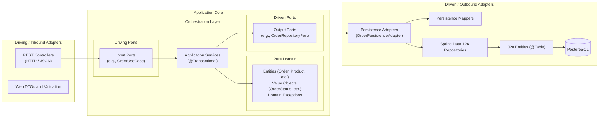
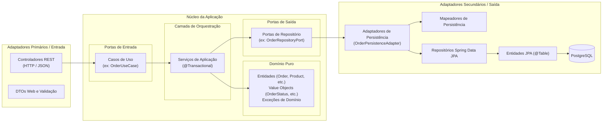

# E-Commerce Backend API

[English](#english) | [Português (Brasil)](#português-brasil)

---

<a name="english"></a>

## English

A modern, robust e-commerce RESTful API developed with Java 21 and Spring Boot, architected using Hexagonal Architecture (Ports and Adapters) and backed by PostgreSQL.

### Table of Contents

- [Overview](#overview)
- [Architectural Decisions and Design Principles](#architectural-decisions-and-design-principles)
  - [Why Hexagonal Architecture?](#why-hexagonal-architecture)
  - [Core Hexagon vs. Adapters](#core-hexagon-vs-adapters)
  - [Domain Invariants and Database Integrity](#domain-invariants-and-database-integrity)
- [Project Directory Structure](#project-directory-structure)
- [Tech Stack](#tech-stack)
- [Database Setup and Migrations](#database-setup-and-migrations)
- [API Endpoints Overview](#api-endpoints-overview)
- [Getting Started](#getting-started)
  - [Prerequisites](#prerequisites)
  - [Configuration](#configuration)
  - [Running the Application](#running-the-application)
  - [Running Tests](#running-tests)
- [Related Documentation](#related-documentation)

### Overview

This project provides the backend services for an e-commerce platform, handling catalog management, user registrations, cart item orders, payment processing, and checkout workflows.

Originally structured as a traditional 3-tier layered system, the project was migrated to Hexagonal Architecture (Ports and Adapters) to cleanly decouple business logic from external frameworks, databases, and delivery mechanisms.

### Architectural Decisions and Design Principles



#### Why Hexagonal Architecture?

1. **Framework Independence**:
   - The core business domain in `com.ecommerce.domain` contains zero dependencies on Spring, Hibernate, or Jakarta Persistence.
   - Business models are pure Java POJOs that can be tested in isolation in milliseconds without initializing an application context or mocking database drivers.

2. **Decoupled Delivery and Persistence Mechanisms**:
   - Web representations (REST DTOs) are confined to the Inbound REST adapter (`infrastructure/adapters/input/rest`).
   - Database schemas (Hibernate entities, `@Table`, `@ManyToOne`, `@JoinColumn`) are confined to the Outbound Persistence adapter (`infrastructure/adapters/output/persistence`).
   - Dedicated mappers convert between outer representations and internal domain models at the adapter boundaries.

3. **Inversion of Control via Ports**:
   - The Application core defines **Inbound Ports** (`UseCase` interfaces) declaring executable operations, and **Outbound Ports** (`RepositoryPort` interfaces) declaring persistence and infrastructure requirements.
   - External implementations (Spring Data JPA, REST controllers, payment gateways) depend inward on these contracts.

#### Domain Invariants and Database Integrity

- **Centralized Business Rules**: Invariants such as stock deductions, stock replenishment, line-item totals, and order status transitions are encapsulated directly within domain entities (`Product.deductStock()`, `Order.calculateTotal()`).
- **Database Safeguards**: SQL triggers and checks defined in `01_create_database.sql` and `02_functions_triggers_views.sql` serve as secondary integrity safeguards at the database storage layer.

### Project Directory Structure

```
application/src/main/java/com/ecommerce
├── EcommerceApplication.java                   # Spring Boot entry point
│
├── domain/                                     # 1. CORE: Pure Domain (Framework-free)
│   ├── exception/                              # DomainException, ResourceNotFoundException, InsufficientStockException
│   ├── model/                                  # Pure entities (Order, Product, User, Category, Payment, ProductOrder)
│   └── valueobjects/                           # OrderStatus, PaymentStatus
│
├── application/                                # 2. CORE: Application and Use Cases
│   ├── ports/
│   │   ├── input/                              # Driving Ports (CategoryUseCase, OrderUseCase, ProductUseCase, etc.)
│   │   └── output/                             # Driven Ports (CategoryRepositoryPort, OrderRepositoryPort, etc.)
│   └── service/                                # Application Services (implementing Use Cases)
│
└── infrastructure/                             # 3. ADAPTERS: Infrastructure and Frameworks
    ├── adapters/
    │   ├── input/
    │   │   └── rest/                           # Driving Adapters (REST Controllers, Web DTOs, Exception Handler)
    │   │       ├── controller/                 # CategoryController, OrderController, ProductController, etc.
    │   │       ├── dto/                        # Web Request/Response records
    │   │       └── exception/                  # GlobalExceptionHandler (@RestControllerAdvice)
    │   │
    │   └── output/
    │       └── persistence/                    # Driven Adapters (PostgreSQL / Spring Data JPA)
    │           ├── adapter/                    # OrderPersistenceAdapter, ProductPersistenceAdapter, etc.
    │           ├── entity/                     # CategoryJpaEntity, OrderJpaEntity, ProductJpaEntity, etc.
    │           ├── mapper/                     # Domain <-> JPA bidirectional mappers
    │           └── repository/                 # SpringDataOrderRepository, SpringDataProductRepository, etc.
    │
    └── configuration/                          # Spring Beans and infrastructure configurations
```

### Tech Stack

- **Language**: Java 21 (LTS)
- **Framework**: Spring Boot 4.1.0
  - `spring-boot-starter-web` (REST APIs)
  - `spring-boot-starter-data-jpa` (Hibernate ORM and Spring Data)
  - `spring-boot-starter-validation` (Jakarta Validation)
  - `spring-boot-starter-session-jdbc` (Session state management)
- **Database**: PostgreSQL 16
- **Database Migrations**: Flyway
- **Boilerplate Reduction**: Project Lombok
- **Testing**: JUnit 5, Mockito, Spring Boot Test

### Database Setup and Migrations

The database schemas and analytical objects are maintained in the root SQL scripts:

- `01_create_database.sql`: DDL definitions for tables (`tb_user`, `tb_category`, `tb_product`, `tb_payment`, `tb_order`, `tb_product_order`) and performance indexes.
- `02_functions_triggers_views.sql`: Triggers (`trg_check_product_stock`, `trg_update_order_total`), helper procedures, and analytics views (`vw_product_sales_summary`, `vw_customer_summary`, `vw_low_stock_products`).

### API Endpoints Overview

All REST endpoints are prefixed with `/api` and return standardized JSON responses:

| Resource           | Method   | Endpoint               | Description                   |
| :----------------- | :------- | :--------------------- | :---------------------------- |
| **Categories**     | `GET`    | `/api/categories`      | List all categories           |
|                    | `GET`    | `/api/categories/{id}` | Get category by ID            |
|                    | `POST`   | `/api/categories`      | Create a new category         |
|                    | `PUT`    | `/api/categories/{id}` | Update category details       |
|                    | `DELETE` | `/api/categories/{id}` | Delete category by ID         |
| **Products**       | `GET`    | `/api/products`        | List all products             |
|                    | `GET`    | `/api/products/{id}`   | Get product by ID             |
|                    | `POST`   | `/api/products`        | Create a new product          |
|                    | `PUT`    | `/api/products/{id}`   | Update product details        |
|                    | `DELETE` | `/api/products/{id}`   | Delete product by ID          |
| **Users**          | `GET`    | `/api/users`           | List all registered users     |
|                    | `GET`    | `/api/users/{id}`      | Get user profile by ID        |
|                    | `POST`   | `/api/users`           | Register a new user           |
|                    | `PUT`    | `/api/users/{id}`      | Update user profile           |
|                    | `DELETE` | `/api/users/{id}`      | Remove user                   |
| **Orders**         | `GET`    | `/api/orders`          | List customer orders          |
|                    | `GET`    | `/api/orders/{id}`     | Get order details by ID       |
|                    | `POST`   | `/api/orders`          | Create an order               |
|                    | `PUT`    | `/api/orders/{id}`     | Update order status / payment |
|                    | `DELETE` | `/api/orders/{id}`     | Cancel/delete order           |
| **Product Orders** | `GET`    | `/api/product-orders`  | List order item line records  |
|                    | `POST`   | `/api/product-orders`  | Add line item to order        |
| **Payments**       | `GET`    | `/api/payments`        | List payments                 |
|                    | `GET`    | `/api/payments/{id}`   | Get payment by ID             |
|                    | `POST`   | `/api/payments`        | Process new payment           |
|                    | `PUT`    | `/api/payments/{id}`   | Update payment status         |

### Getting Started

#### Prerequisites

- JDK 21 installed and configured (`java -version`).
- PostgreSQL 16 running locally or via Docker.

#### Configuration

Application configuration is located at `application/src/main/resources/application.properties`.

Override PostgreSQL connection credentials using environment variables if needed:

```bash
export DB_USERNAME=postgres
export DB_PASSWORD=your_password
```

#### Running the Application

Navigate to the `application/` directory and use the Maven Wrapper:

```bash
cd application
./mvnw spring-boot:run
```

The application will start on port `8080` (`http://localhost:8080`).

#### Running Tests

Execute the unit and application service test suite:

```bash
cd application
./mvnw test
```

### Related Documentation

- `HEXAGONAL-ARCHITECTURE-ANALYSIS.md`: In-depth comparison between the original layered architecture and the target hexagonal design.
- `ROADMAP-E-COMMERCE.md`: Multi-phase development roadmap (security, authentication, checkout workflow, frontend storefront).

---

<a name="português-brasil"></a>

## Português (Brasil)

Uma API RESTful de e-commerce moderna e robusta desenvolvida com Java 21 e Spring Boot, estruturada sob a Arquitetura Hexagonal (Ports and Adapters) e integrada com PostgreSQL.

### Sumário

- [Visão Geral](#visão-geral)
- [Decisões Arquiteturais e Princípios de Design](#decisões-arquiteturais-e-princípios-de-design)
  - [Por que Arquitetura Hexagonal?](#por-que-arquitetura-hexagonal)
  - [Núcleo Hexagonal vs. Adaptadores](#núcleo-hexagonal-vs-adaptadores)
  - [Invariantes de Domínio e Integridade no Banco de Dados](#invariantes-de-domínio-e-integridade-no-banco-de-dados)
- [Estrutura de Diretórios do Projeto](#estrutura-de-diretórios-do-projeto)
- [Tecnologias Utilizadas](#tecnologias-utilizadas)
- [Configuração do Banco de Dados e Migrações](#configuração-do-banco-de-dados-e-migrações)
- [Visão Geral dos Endpoints da API](#visão-geral-dos-endpoints-da-api)
- [Como Começar](#como-começar)
  - [Pré-requisitos](#pré-requisitos)
  - [Configuração](#configuração-1)
  - [Executando a Aplicação](#executando-a-aplicação)
  - [Executando Testes](#executando-testes)
- [Documentações Relacionadas](#documentações-relacionadas)

### Visão Geral

Este projeto disponibiliza serviços de backend para uma plataforma de comércio eletrônico, gerenciando catálogo de produtos, registro de usuários, pedidos de itens, processamento de pagamentos e fluxos de checkout.

Originalmente estruturado em uma arquitetura tradicional em 3 camadas, o projeto foi migrado para a Arquitetura Hexagonal (Portas e Adaptadores) para desacoplar completamente a lógica de negócios de frameworks externos, bancos de dados e protocolos de entrega.

### Decisões Arquiteturais e Princípios de Design



#### Por que Arquitetura Hexagonal?

1. **Independência de Frameworks**:
   - O núcleo de domínio de negócios em `com.ecommerce.domain` possui zero dependências de Spring, Hibernate ou anotações Jakarta Persistence.
   - Os modelos de negócio são POJOs Java puros testáveis de forma isolada em milissegundos, sem necessidade de inicializar contextos do Spring ou mockar conexões de banco de dados.

2. **Desacoplamento de Protocolos de Entrega e Persistência**:
   - Modelos de apresentação Web (DTOs) ficam restritos ao adaptador de entrada REST (`infrastructure/adapters/input/rest`).
   - Esquemas de banco de dados (entidades Hibernate, anotações `@Table`, `@ManyToOne`, `@JoinColumn`) ficam restritos ao adaptador de persistência (`infrastructure/adapters/output/persistence`).
   - Mapeadores dedicados realizam a conversão bidirecional entre as representações externas e os modelos de domínio nas fronteiras dos adaptadores.

3. **Inversão de Controle via Portas**:
   - O núcleo da aplicação define **Portas de Entrada** (interfaces `UseCase`) que declaram o que a aplicação faz, e **Portas de Saída** (interfaces `RepositoryPort`) que declaram o que o domínio necessita do mundo externo.
   - Implementações externas (Spring Data JPA, controladores REST, gateways de pagamento) dependem para dentro em direção a esses contratos.

#### Invariantes de Domínio e Integridade no Banco de Dados

- **Regras de Negócio Centralizadas**: Invariantes como baixa de estoque, reposição, cálculo do total de pedidos e transições de status de pedidos estão encapsuladas diretamente nas entidades de domínio (`Product.deductStock()`, `Order.calculateTotal()`).
- **Garantias no Banco de Dados**: Triggers e constraints SQL definidas em `01_create_database.sql` e `02_functions_triggers_views.sql` funcionam como salvaguardas adicionais na camada de persistência.

### Estrutura de Diretórios do Projeto

```
application/src/main/java/com/ecommerce
├── EcommerceApplication.java                   # Classe principal Spring Boot
│
├── domain/                                     # 1. NÚCLEO: Domínio Puro (Livre de Frameworks)
│   ├── exception/                              # DomainException, ResourceNotFoundException, InsufficientStockException
│   ├── model/                                  # Entidades puras (Order, Product, User, Category, Payment, ProductOrder)
│   └── valueobjects/                           # OrderStatus, PaymentStatus
│
├── application/                                # 2. NÚCLEO: Aplicação e Casos de Uso
│   ├── ports/
│   │   ├── input/                              # Portas de Entrada (CategoryUseCase, OrderUseCase, ProductUseCase, etc.)
│   │   └── output/                             # Portas de Saída (CategoryRepositoryPort, OrderRepositoryPort, etc.)
│   └── service/                                # Serviços de Aplicação (implementando Casos de Uso)
│
└── infrastructure/                             # 3. ADAPTADORES: Infraestrutura e Frameworks
    ├── adapters/
    │   ├── input/
    │   │   └── rest/                           # Adaptadores de Entrada (Controllers REST, DTOs, Handler de Exceções)
    │   │       ├── controller/                 # CategoryController, OrderController, ProductController, etc.
    │   │       ├── dto/                        # Records de Requisição e Resposta HTTP
    │   │       └── exception/                  # GlobalExceptionHandler (@RestControllerAdvice)
    │   │
    │   └── output/
    │       └── persistence/                    # Adaptadores de Saída (PostgreSQL / Spring Data JPA)
    │           ├── adapter/                    # OrderPersistenceAdapter, ProductPersistenceAdapter, etc.
    │           ├── entity/                     # CategoryJpaEntity, OrderJpaEntity, ProductJpaEntity, etc.
    │           ├── mapper/                     # Mapeadores bidirecionais Domínio <-> JPA
    │           └── repository/                 # SpringDataOrderRepository, SpringDataProductRepository, etc.
    │
    └── configuration/                          # Configurações de Beans e Infraestrutura Spring
```

### Tecnologias Utilizadas

- **Linguagem**: Java 21 (LTS)
- **Framework**: Spring Boot 4.1.0
  - `spring-boot-starter-web` (APIs REST)
  - `spring-boot-starter-data-jpa` (Hibernate ORM e Spring Data)
  - `spring-boot-starter-validation` (Validação Jakarta)
  - `spring-boot-starter-session-jdbc` (Gerenciamento de sessão JDBC)
- **Banco de Dados**: PostgreSQL 16
- **Migrações de Banco de Dados**: Flyway
- **Produtividade**: Project Lombok
- **Testes**: JUnit 5, Mockito, Spring Boot Test

### Configuração do Banco de Dados e Migrações

Os scripts SQL com esquemas e rotinas analíticas estão disponíveis na raiz do projeto:

- `01_create_database.sql`: Definição DDL das tabelas (`tb_user`, `tb_category`, `tb_product`, `tb_payment`, `tb_order`, `tb_product_order`) e índices de desempenho.
- `02_functions_triggers_views.sql`: Gatilhos/Triggers (`trg_check_product_stock`, `trg_update_order_total`), procedimentos utilitários e visões analíticas (`vw_product_sales_summary`, `vw_customer_summary`, `vw_low_stock_products`).

### Visão Geral dos Endpoints da API

Todos os endpoints REST são prefixados com `/api` e retornam respostas padronizadas em JSON:

| Recurso             | Método   | Endpoint               | Descrição                              |
| :------------------ | :------- | :--------------------- | :------------------------------------- |
| **Categorias**      | `GET`    | `/api/categories`      | Lista todas as categorias              |
|                     | `GET`    | `/api/categories/{id}` | Busca categoria por ID                 |
|                     | `POST`   | `/api/categories`      | Cadastra uma nova categoria            |
|                     | `PUT`    | `/api/categories/{id}` | Atualiza dados da categoria            |
|                     | `DELETE` | `/api/categories/{id}` | Remove categoria por ID                |
| **Produtos**        | `GET`    | `/api/products`        | Lista todos os produtos                |
|                     | `GET`    | `/api/products/{id}`   | Busca produto por ID                   |
|                     | `POST`   | `/api/products`        | Cadastra um novo produto               |
|                     | `PUT`    | `/api/products/{id}`   | Atualiza dados do produto              |
|                     | `DELETE` | `/api/products/{id}`   | Remove produto por ID                  |
| **Usuários**        | `GET`    | `/api/users`           | Lista todos os usuários                |
|                     | `GET`    | `/api/users/{id}`      | Busca usuário por ID                   |
|                     | `POST`   | `/api/users`           | Registra novo usuário                  |
|                     | `PUT`    | `/api/users/{id}`      | Atualiza dados do usuário              |
|                     | `DELETE` | `/api/users/{id}`      | Remove usuário                         |
| **Pedidos**         | `GET`    | `/api/orders`          | Lista os pedidos                       |
|                     | `GET`    | `/api/orders/{id}`     | Busca pedido por ID                    |
|                     | `POST`   | `/api/orders`          | Cria um pedido                         |
|                     | `PUT`    | `/api/orders/{id}`     | Atualiza status ou pagamento do pedido |
|                     | `DELETE` | `/api/orders/{id}`     | Cancela/remove pedido                  |
| **Itens do Pedido** | `GET`    | `/api/product-orders`  | Lista itens associados a pedidos       |
|                     | `POST`   | `/api/product-orders`  | Adiciona item a um pedido              |
| **Pagamentos**      | `GET`    | `/api/payments`        | Lista pagamentos                       |
|                     | `GET`    | `/api/payments/{id}`   | Busca pagamento por ID                 |
|                     | `POST`   | `/api/payments`        | Registra novo pagamento                |
|                     | `PUT`    | `/api/payments/{id}`   | Atualiza status do pagamento           |

### Como Começar

#### Pré-requisitos

- JDK 21 instalado e configurado (`java -version`).
- PostgreSQL 16 em execução localmente ou via container Docker.

#### Configuração

O arquivo de configuração está localizado em `application/src/main/resources/application.properties`.

As credenciais do PostgreSQL podem ser substituídas via variáveis de ambiente:

```bash
export DB_USERNAME=postgres
export DB_PASSWORD=sua_senha
```

#### Executando a Aplicação

Navegue até a pasta `application/` e execute o Maven Wrapper:

```bash
cd application
./mvnw spring-boot:run
```

A aplicação será iniciada na porta `8080` (`http://localhost:8080`).

#### Executando Testes

Para rodar a suíte de testes unitários e de serviços:

```bash
cd application
./mvnw test
```

### Documentações Relacionadas

- `HEXAGONAL-ARCHITECTURE-ANALYSIS.md`: Análise comparativa aprofundada entre a arquitetura em camadas anterior e a arquitetura hexagonal adotada.
- `ROADMAP-E-COMMERCE.md`: Roadmap de evolução do sistema (segurança, JWT, checkout transacional e frontend).
